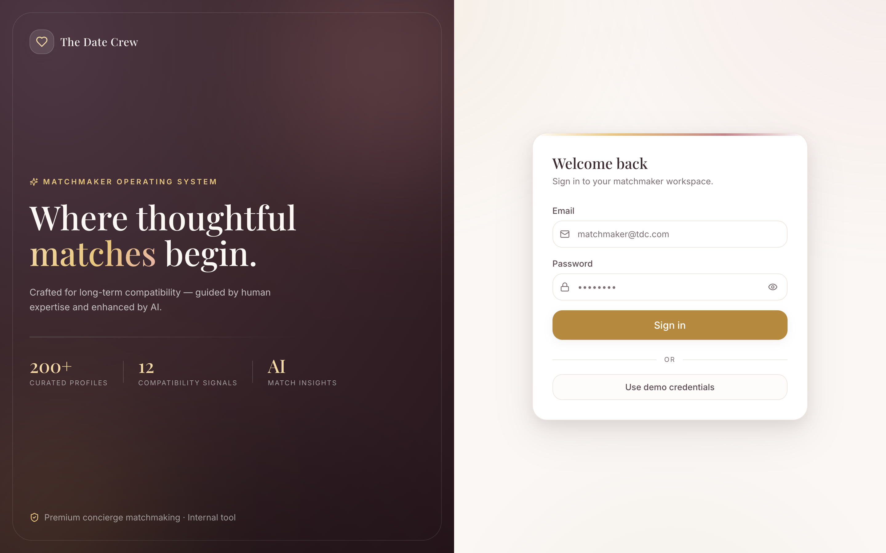
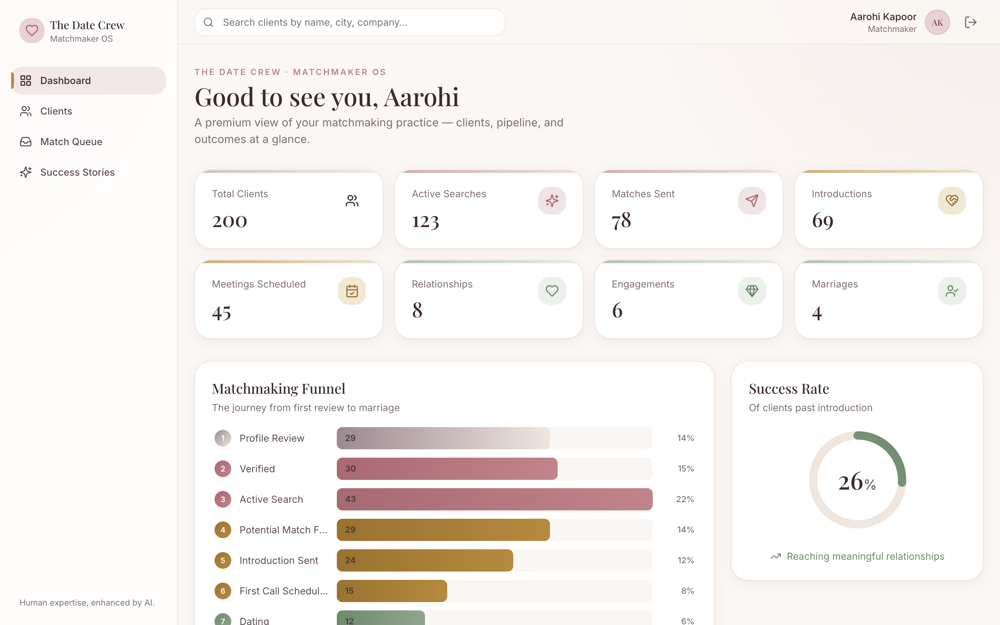
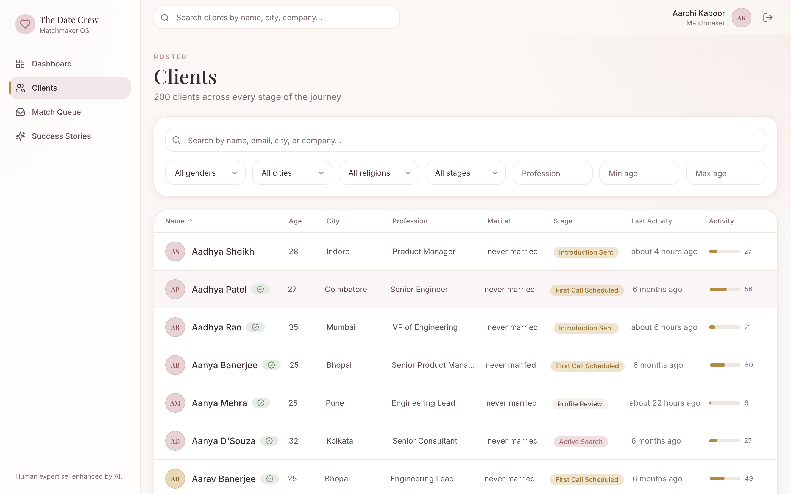
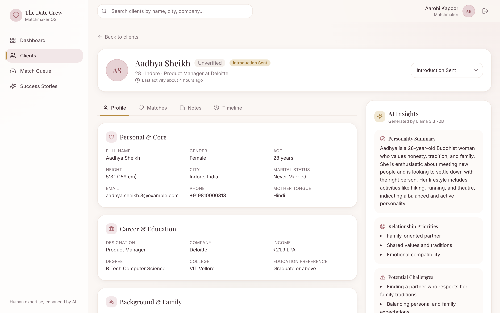
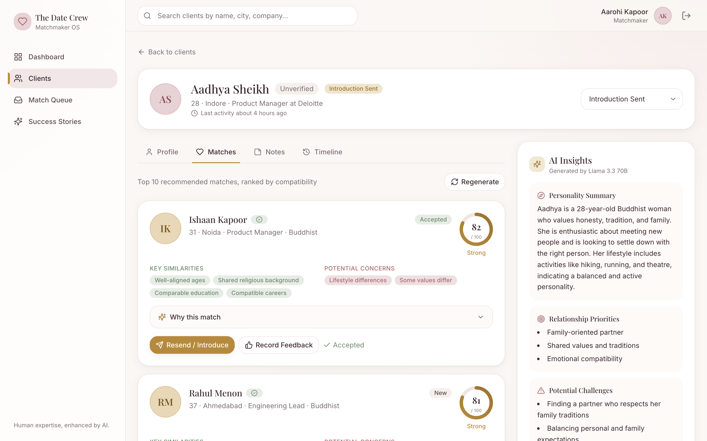

# TDC Matchmaker OS

An AI-assisted operating system for professional matchmakers at The Date Crew.

This is an internal tool, not a dating app and not a matrimonial marketplace. It is the software a premium matchmaking agency uses every day to manage clients, track each person's journey, generate curated matches with explainable scoring, draft introductions, and record coaching insights — with AI that assists the matchmaker rather than replacing them.

## Live Demo

| | |
|---|---|
| Live application | https://tdc-matchmaker-os.vercel.app |
| API health check | https://tdc-matchmaker-os.onrender.com/api/health |
| Demo login | `matchmaker@tdc.com` / `password123` |

The API runs on a free instance that sleeps after inactivity, so the first request after an idle period can take up to a minute to wake. Once warm, it is fast. If the dashboard looks empty on the very first load, give it a moment and refresh.

## Table of Contents

- [Screenshots](#screenshots)
- [Quick Start](#quick-start)
- [Tech Choices](#tech-choices)
- [Matching Logic](#matching-logic)
- [AI Usage](#ai-usage)
- [Testing](#testing)
- [Business Assumptions](#business-assumptions)
- [Design Philosophy](#design-philosophy)
- [Architecture](#architecture)
- [Deployment](#deployment)
- [Future Improvements](#future-improvements)

## Screenshots

<table>
  <tr>
    <td width="50%" valign="top">
      <br />
      <b>Sign in</b> — a calm, premium entry point for the matchmaker workspace.
    </td>
    <td width="50%" valign="top">
      <br />
      <b>Dashboard</b> — pipeline KPIs, the rose-to-sage matchmaking funnel, and a success-rate ring.
    </td>
  </tr>
  <tr>
    <td width="50%" valign="top">
      <br />
      <b>Clients</b> — the full roster with search, gender, city, religion, stage, profession, and age filters.
    </td>
    <td width="50%" valign="top">
      <br />
      <b>Customer detail</b> — full biodata alongside a live, AI-generated insights panel.
    </td>
  </tr>
  <tr>
    <td width="50%" valign="top">
      <br />
      <b>Matches</b> — the Top 10 ranked by compatibility, each with an AI explanation and a send-introduction action.
    </td>
    <td width="50%" valign="top"></td>
  </tr>
</table>

## Quick Start

You need Node 20+, a PostgreSQL connection string (for example a free [Neon](https://neon.tech) or [Supabase](https://supabase.com) database), and a free [Groq API key](https://console.groq.com/keys).

### 1. Backend

```bash
cd backend
cp .env.example .env          # fill in DATABASE_URL, GROQ_API_KEY, JWT_SECRET
npm install
npx prisma migrate dev --name init   # creates the schema
npm run db:seed               # seeds 200 profiles, matches, and success stories
npm run dev                   # http://localhost:4000  (health: /api/health)
```

### 2. Frontend

```bash
cd frontend
cp .env.example .env          # VITE_API_URL defaults to http://localhost:4000/api
npm install
npm run dev                   # http://localhost:5173
```

Open http://localhost:5173, sign in with the demo credentials, and explore.

## Tech Choices

| Layer | Choice | Why |
|-------|--------|-----|
| Frontend | React + TypeScript + Vite | Fast developer experience, end-to-end type safety, instant hot reload. |
| Styling | Tailwind CSS | Token-driven design system that keeps the visual language consistent across every page. |
| Animation | Framer Motion | Intentional motion (page transitions, funnel reveal, send-match stepper, count-ups), all gated by `prefers-reduced-motion`. |
| Data fetching | TanStack Query + axios | Caching, optimistic updates, and clean loading and error states without boilerplate. |
| Forms | react-hook-form + zod | Robust validation on the login and note composer. |
| Backend | Node + Express + TypeScript | Minimal and explicit, organised in a feature-based clean architecture (routes, schema, service). |
| ORM and DB | Prisma + PostgreSQL | Type-safe queries, painless migrations, and an honest relational model for a relationship product. |
| Auth | JWT (`jsonwebtoken`) + `bcryptjs` | Stateless and simple for a single-matchmaker internal tool. |
| AI | Groq SDK with `llama-3.3-70b-versatile` | Fast inference; all three AI features call it live, with no hardcoded responses. |
| Testing | Vitest | A fast, dependency-free unit suite for the matching engine. |
| Icons | Lucide (SVG) | Crisp, professional iconography rather than emoji. |

The repository is a monorepo: `backend/` holds the API, engine, and seed; `frontend/` holds the single-page app.

## Matching Logic

The compatibility engine is fully deterministic. There is no randomness anywhere, so the same database state always produces the same ranking. Source: [`backend/src/services/compatibility/`](backend/src/services/compatibility/).

### Twelve scored dimensions

Each client-candidate pair is scored from 0 to 100 on twelve dimensions: Age, Location, Religion, Language, Education, Profession, Family, Lifestyle, Children, Relocation, Pets, and Values.

Selected per-dimension rules:

- Age — candidate age against the client's preferred range, with full marks inside the band and linear decay outside. With no stated preference, gender-typical expectations apply.
- Location — same city scores 100, a preferred city 80, same state 70, same region 55, and lower otherwise; openness to relocation raises a low score to a floor of 60.
- Religion — an exact match scores 100, culturally adjacent religions get partial credit, and otherwise it is low. A "same religion" non-negotiable forces a hard 0 on mismatch.
- Language, Lifestyle, and Values — Jaccard set overlap, with bonuses such as a shared mother tongue and non-negotiable satisfaction checks.
- Children — a wantKids matrix, for example YES and YES scores 100, while YES and NO scores 10.
- Profession, Education, Family, Pets, and Relocation — tier and ordinal comparisons (see [`scorers.ts`](backend/src/services/compatibility/scorers.ts)).

Missing data resolves to a neutral 50. It never crashes and never spikes a score.

### Gender-specific weighting

The twelve dimensions are combined with weights keyed by the client's gender. Each table sums to exactly 1.00, asserted at module load in [`weights.ts`](backend/src/services/compatibility/weights.ts):

- Male clients prioritise the candidate being younger, shorter, and lower income, along with a matching children preference, then lifestyle, religion, family values, language, and relocation. Height folds a small modifier into the age score, and lower income dominates the male profession scorer.
- Female clients prioritise profession compatibility, values, and relocation, then education, lifestyle, family expectations, long-term goals, and children. Long-term goals fold into the values score, and the female profession scorer rewards stability rather than lower income.

### Output

```
overallScore = round( sum of  dimensionScore x weight[clientGender][dimension] )
```

- Strength areas — dimensions at or above 80 (top four), surfaced as human labels such as "Shared core values".
- Potential concerns — dimensions below 50 (up to four).
- Top 10 matches — the opposite-gender pool, ranked by score descending and tie-broken by candidate id ascending for a stable, reproducible ranking. Persisted idempotently with a unique constraint on (customerId, candidateId).

## AI Usage

All AI is live through Groq's `llama-3.3-70b-versatile`. There are no hardcoded or templated AI outputs. Every prompt instructs the model to use only the provided data and never fabricate. Source: [`backend/src/services/groq/`](backend/src/services/groq/).

1. Match explanation, "Why this match" — given both profiles and the twelve-dimension breakdown, it generates a warm, matchmaker-quality rationale (temperature 0.3). It is cached on the match and can be regenerated with `?refresh=true`.
2. Introduction generator — produces warm, professional, and personalized introduction variants using JSON mode (temperature 0.6), surfaced in the multi-step send-match flow.
3. Matchmaker insights — analyses a client's profile, preferences, notes, and timeline to return a personality summary, relationship priorities, potential challenges, and a suggested strategy (JSON mode, validated with zod, temperature 0.4).

If `GROQ_API_KEY` is absent the app still boots and runs. Only the AI endpoints return a clear `503 AI_UNAVAILABLE`, and the rest of the workbench keeps working.

## Testing

The matching engine is the core of the product, so it is covered by a fast, database-free unit suite ([Vitest](https://vitest.dev)) that pins the assignment's exact rules:

```bash
cd backend && npm test
```

```
Test Files  2 passed (2)
     Tests  20 passed (20)
```

Coverage highlights — every claim the matching logic makes is asserted:

- Male-client rules — a younger candidate out-scores an older one, a candidate zero to six years younger is perfect, a shorter candidate is nudged up, and a lower-income candidate is preferred over a higher-income one.
- Female-client rules — comparable or higher income is rewarded (the inverse of the male rule), and profession, values, and relocation carry more weight.
- Children alignment — YES against NO is a hard clash, and an exact match is perfect.
- Aggregation — both gender weight tables sum to exactly 1.00, scores and the twelve-dimension breakdown stay within 0 to 100, and identical inputs are deterministic.
- Ranking — opposite gender only, excludes self, sorted by score descending, capped at the Top 10, with ties broken deterministically by candidate id.

## Business Assumptions

- One matchmaker, many clients. The demo models a single matchmaker who owns the whole roster. The schema already supports many matchmakers through `assignedMatchmakerId`.
- Indian matchmaking context. Seed data and fields (mother tongue, caste, manglik, diet, family type, non-negotiables) reflect a premium Indian agency. Religion adjacency and the city, state, and region maps are tuned for India.
- Opposite-gender matching. The candidate pool for a client is the opposite gender, and already married or engaged profiles are excluded from new recommendations.
- The funnel is the source of truth for a client's journey. KPIs and the success rate are derived from stage counts. Success means reaching Relationship, Engaged, or Married, and the denominator is everyone past Introduction Sent.
- AI assists, it never decides. Scores and rankings are deterministic and explainable; AI only adds language and insight on top.
- Send Match is a simulated workflow, not a live email. Per the brief, which allows a mock email or a modal and toast, sending an introduction is modelled end to end in the database: it advances the client's stage, stores the chosen introduction copy, bumps activity, and writes an INTRODUCTION_SENT timeline event, then surfaces a success state in the UI. Wiring a real provider such as Resend or SES is a single-function change in `matches.service.ts`.

## Design Philosophy

The product is built to feel like premium concierge software rather than an admin template, communicating trust, warmth, professionalism, and relationship success.

The visual language is a warm editorial concierge style, light theme only:

- Palette — a warm ivory canvas (#FBF7F4), deep-plum ink (#3B2A30), dusty rose (#C2848B), soft gold (#B68A3E) for primary actions, and sage (#8FA68E) for success and relationships.
- Typography — Playfair Display for editorial serif headings and Inter for clean body text.
- Texture — soft shadows, generous spacing, rounded cards, and refined 150 to 300 millisecond hover transitions.
- Motion — intentional and never decorative: editorial page transitions, a sequentially revealing funnel, an animated send-match stepper, and count-ups, with every animation respecting `prefers-reduced-motion`.
- Accessibility — 4.5:1 text contrast, visible focus rings, labelled inputs, large touch targets, colour is never the only signal, and toasts announce through `aria-live`.

The colour progression itself tells the story: the matchmaking funnel warms from rose through gold to sage as clients move toward marriage.

## Architecture

```
TDC Matchmaker OS/
- backend/
  - prisma/
    - schema.prisma           Matchmaker, Customer, Note, TimelineEvent, Match, MatchFeedback
    - seed/                   deterministic 200-profile generator plus matches and stories
  - src/
    - config, lib, middleware, errors, types
    - features/               auth, customers, notes, timeline, matches, feedback, dashboard, ai
    - services/
      - compatibility/        the deterministic scoring engine (pure functions)
      - matchEngine/          Top 10 generation
      - groq/                 live AI (client, prompts, service)
- frontend/
  - src/
    - app, lib, theme, types, layouts
    - components/             ui, feedback, data-display, filters
    - features/               auth, dashboard, customers, workbench, queue, success
```

Key API routes (all under `/api`, JWT-protected except `/auth/login` and `/health`): `auth/login`, `dashboard/kpis`, `dashboard/funnel`, `customers` (filters, search, pagination), `customers/:id`, `customers/:id/notes`, `customers/:id/timeline`, `customers/:id/matches[/generate]`, `customers/:id/insights`, `matches/:id[/status|/send|/feedback|/explanation|/introduction]`, `matches/queue`, and `success-stories`.

## Deployment

The application deploys to Render (API) and Vercel (frontend), with PostgreSQL hosted on Neon. Both halves build from this repository.

### Backend on Render

A root-level [`render.yaml`](render.yaml) blueprint is included. Set the service root directory to `backend` and use:

```
build:  npm install --include=dev && npx prisma migrate deploy && npm run build
start:  npm run start
```

Set these environment variables in the Render dashboard (do not set `PORT`; Render injects it):

- `DATABASE_URL` — the Neon or Supabase connection string (include `?sslmode=require`).
- `GROQ_API_KEY` — a free key from https://console.groq.com/keys.
- `CLIENT_ORIGIN` — the Vercel URL (a comma-separated list is supported).
- `JWT_SECRET` — any long random string.
- `JWT_EXPIRES_IN` — `7d`. `NODE_ENV` — `production`.

The health check path is `/api/health`. Migrations run on each deploy; seeding is a one-time step run locally against the database.

### Frontend on Vercel

A [`frontend/vercel.json`](frontend/vercel.json) (Vite preset, single-page-app rewrites) is included.

1. Import the repository and set the root directory to `frontend`.
2. Add one environment variable: `VITE_API_URL` set to the Render API URL plus `/api`, for example `https://tdc-matchmaker-os.onrender.com/api`.
3. Deploy, then set the resulting Vercel URL as `CLIENT_ORIGIN` on Render.

## Future Improvements

- Multi-matchmaker roles, assignment, and team dashboards.
- Configurable weights so senior matchmakers can tune dimension weights per client without code.
- An AI feedback loop that learns from match feedback to re-rank and explain why a past match did not work.
- Real-time updates over websockets for the queue and timeline.
- Calendar and messaging integrations for the introduction and first-call workflow.
- An audit log and analytics covering cohort success rates, time in stage, and matchmaker performance.
- Expanded test coverage extending the engine tests to the API routes and a few frontend component tests.
- Route-level code splitting for the frontend bundle.
